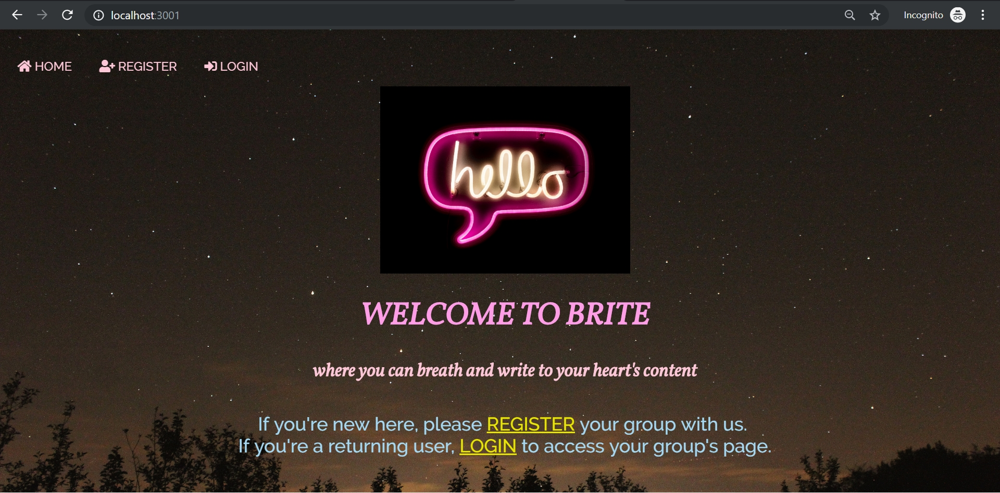

# express-yourself-fullstack-app
This is a website for teenagers/ young adults who suffer anxiety and depression. The vision is to coorperate with schools or health centers and have a group of users to share one account. Account passwords are hashed for good security and cookies are cleaned when users logout. After login, users can access activities that help deal with anxiety/depression.
* Postgres SQL
* Node JS
* Javascript
* Dependencies: bcrypt, cookie-parser, dotenv, ejs, express, express-flash, express-session, express-validator, morgan, pg, pg-hstore, sequelize.

**Color palette:** Sail (#A5D8F3), Pink Lace (#FDC7D7), Lavender Rose (#FF9DE6), and Golden Yellow (#E8E500).

On the first page, there are options to register or to login.  

After login, users are taken to the group's home page.

The website is responsive. On mobile screen, the navigation bar is condensed into a heart pulse icon. When users hover the mouse over the icon, the navigation bar is dropped down.

On the group's home page, users can select activities such as "breath" or "write" by clicking on the navigation bar or by hovering over the photos.

On Breath page, users inhale and exhale deeply in sync with a GIF to help slow down their heart beats and as a result, calm themselves down.

On Write page, users can write about their feelings, thoughts, or emotions as a way to let it all out. 

For better visibility, the text area changed colors when user start typing.

All messages from users in the same group are posted anynomously into a shared diary.

